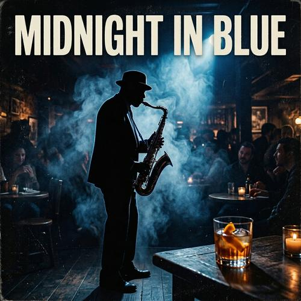

# Vinyl Album Cover Art

[← Back to Image Prompts](../README.md)

Classic album cover compositions designed for the square vinyl format — bold iconic single-image compositions with genre-specific aesthetics, from jazz noir to psychedelic rock to minimalist electronic. Ready to print at 12" × 12".



> **Sample prompt used to generate the above image (Nano Banana 2):**
> ```text
> Album cover art for a jazz record titled "Midnight in Blue," 1:1 square format. A lone
> saxophone player silhouetted against a smoky blue spotlight in an intimate underground
> club. Deep midnight blue and warm amber color palette. Film grain texture throughout.
> The smoke catches the spotlight beam in volumetric layers. Moody, cinematic composition
> with the musician slightly off-center. A vintage cocktail glass on a small table in the
> foreground. Inspired by the iconic Blue Note Records cover photography of Francis Wolff.
> Bold sans-serif typography reading "MIDNIGHT IN BLUE" at the top in cream white.
> ```

**ChatGPT**
```text
Create album cover art for a [GENRE] record titled "[TITLE]" in a 1:1 square format. The image should feature [SUBJECT] in a [ENVIRONMENT] that evokes the visual language of classic [GENRE] album covers. Use a curated color palette of [COLORS]. The composition should be bold and iconic — a single strong image that reads clearly at both full size and thumbnail. Include subtle film grain texture. Add tasteful typography reading "[TITLE]" in a style appropriate to the genre — [TYPOGRAPHY STYLE, e.g., "bold condensed sans-serif," "hand-drawn psychedelic lettering," "clean minimal type"].
```

**Midjourney**
```text
Album cover art for a [GENRE] record, [SUBJECT] in [ENVIRONMENT], [COLORS] color palette, bold iconic composition, film grain texture, classic [GENRE] record cover aesthetic, typography reading "[TITLE]" --ar 1:1 --s 200
```

**Stable Diffusion**
- **Prompt:** `Album cover art, [GENRE] record, [SUBJECT] in [ENVIRONMENT], [COLORS] palette, bold iconic composition, film grain, classic record cover aesthetic, typography "[TITLE]", 1:1 square format`
- **Negative Prompt:** `blurry, cluttered, amateur, bright saturated, text errors`

**Nano Banana 2**
```text
Album cover art for a [GENRE] record titled "[TITLE]," 1:1 square format. [SUBJECT] in a [ENVIRONMENT] evoking the visual language of classic [GENRE] album covers. Curated color palette of [COLORS]. Bold iconic composition — a single strong image that reads clearly at both full size and thumbnail. Subtle film grain texture throughout. Tasteful typography reading "[TITLE]" in a style appropriate to the genre.
```
