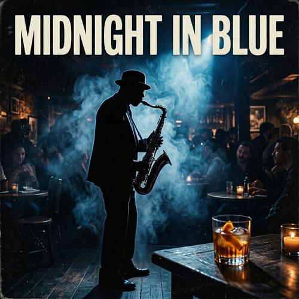

# Vinyl Album Cover Art

[← Back to Image Prompts](../README.md)

Classic album cover compositions designed for the square vinyl format — bold, iconic single-image compositions with genre-specific aesthetics. From Blue Note jazz noir to psychedelic rock swirls to the geometric precision of Kraftwerk's electronic covers, album art is one of the most recognized forms of commercial illustration. The format's square discipline (12" × 12") forces strong, centered compositions that read at both full size and thumbnail.

**Best for:** Album covers · Playlist covers · Social media posts · Poster prints · Music branding · Spotify/Apple Music artwork



---

## Prompt

Replace the bracketed details with your subject and preferred format.

```text
Album cover art for a [SUBGENRE — e.g., late-night jazz] record titled "[TITLE]," 1:1 square format. [SCENE — e.g., a lone pianist silhouetted at a grand piano in a smoky club, spotlight from above catching the smoke in volumetric layers]. Deep [PALETTE — e.g., midnight blue and warm amber] color palette. Subtle film grain texture throughout. Moody, cinematic composition. Inspired by Blue Note Records cover photography. Bold [FONT STYLE — e.g., condensed sans-serif] typography reading "[TITLE]" at the top and artist name "[ARTIST]" at the bottom. Timeless, sophisticated.
```

## With a Reference Image

Attach your image and use this prompt to preserve its defining features while applying the style.

```text
Using the attached photo as reference, transform it into album cover art for a [GENRE] record titled "[TITLE]." Recompose for a 1:1 square format with a bold, iconic composition. Apply the visual language of classic [GENRE] album covers: [STYLE DETAILS]. Add [FONT STYLE] typography reading "[TITLE]" at the [POSITION] and "[ARTIST]" at the [POSITION]. Add subtle film grain texture.
```

---

## 💡 Tips & Best Practices

- **Name the genre tradition**: "Blue Note Records" (jazz), "Storm Thorgerson" (prog rock), "Peter Saville" (electronic), "Victor Moscoso" (psychedelic) — these references give the AI a specific visual tradition to follow.
- **Square is non-negotiable**: Always use `1:1`. Album art lives in a square.
- **Typography matters**: Specify the font style (condensed sans-serif, hand-drawn psychedelic, minimal Helvetica) and placement. Typography is part of the composition.
- **Film grain authenticates**: "Subtle film grain texture throughout" adds the analog warmth that makes album art feel real.
- **Common pitfalls**: Don't skip the genre reference — "album cover" alone produces generic results. Don't place text as an afterthought — it should be designed into the composition.
- **Pairs well with:** [Concert Poster](concert-poster.md) (same music-adjacent art tradition, vertical format), [Double Exposure](double-exposure.md) (popular album cover technique)
