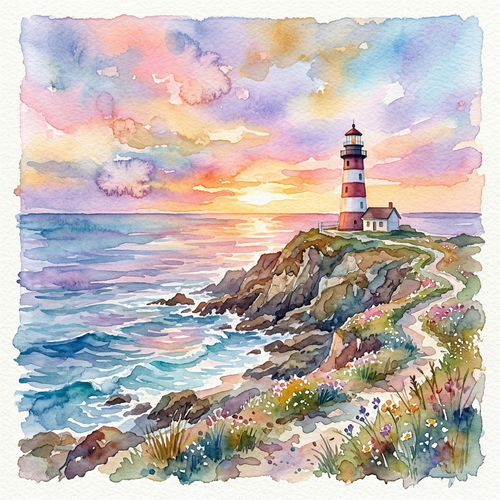

# Watercolor Painting

[← Back to Image Prompts](../README.md)

Fluid, translucent, and luminous watercolor art characterized by soft washes, visible color blooms, and delicate blending. This style captures the unpredictable and organic nature of water-based pigments on rough-pressed paper, perfect for conveying emotion, atmosphere, and natural beauty.

**Best for:** Landscapes · Botanical art · Children's book illustrations · Fashion sketches · Stationery · Dreamy concepts



> **Sample prompt used to generate the above image (Nano Banana 2):**
> ```text
> A beautiful, fluid watercolor painting of a coastal lighthouse at sunset, with soft translucent washes, visible blooms, vibrant pastel colors blending together, and watercolor paper texture.
> ```

---

## Prompt Variations

### 🔵 Nano Banana 2 _(Featured)_

**Variation 1 — Fluid Landscape** _(Art Print)_ — Fluid watercolor painting of [LANDSCAPE], soft translucent washes, visible color blooms, atmospheric blending, cold-pressed watercolor paper texture.

**Variation 2 — Botanical Illustration** _(Stationery)_ — Delicate watercolor painting of [FLOWERS/PLANTS], loose expressive brushstrokes, vibrant but translucent colors, white paper background with paint splatters.

**Variation 3 — Character/Portrait** _(Illustration)_ — Expressive watercolor portrait of [SUBJECT], loose washes, colors bleeding outside the lines, dreamy and ethereal aesthetic.

**Variation 4 — Urban Sketch** _(Travel Art)_ — Pen and wash style, loose watercolor painting over ink sketch of [CITYSCAPE/BUILDING], vibrant splashes of color, sketchy linework.

### ChatGPT / Midjourney / Stable Diffusion — Standard templates with "watercolor painting, translucent washes, visible blooms, fluid blending, watercolor paper texture" core keywords.

---

## 🔄 Image-to-Image Transformations

**Nano Banana 2** _(Featured)_
```text
Using the attached photo, transform it into a fluid watercolor painting. Soften the details into translucent color washes that bleed and blend organically. Add visible watercolor blooms, wet-on-wet painting effects, and occasional paint splatters. Set the artwork on a textured cold-pressed watercolor paper background.
```
> 💡 **Follow-up refinements:**
> - "Make it more loose and abstract"
> - "Add ink outlines (pen and wash style)"

---

## 💡 Tips & Best Practices
- **"Translucent washes" and "visible blooms"**: These are the hallmark characteristics of real watercolor that you must prompt for.
- **"Cold-pressed watercolor paper"**: Essential for getting the right canvas texture.
- **"Loose and expressive"**: Prevents the AI from making the watercolor look too tight, digital, or realistic.
- **Pairs well with:** [Soft Pastel](soft-pastel.md), [Botanical Illustration](botanical-illustration.md)
