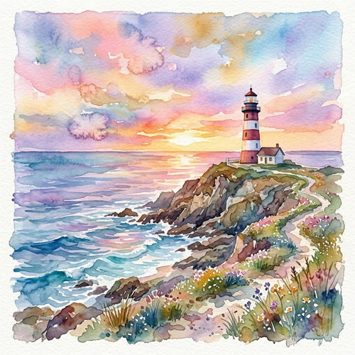

# Watercolor Painting

[← Back to Image Prompts](../README.md)

Fluid, translucent, and luminous watercolor art characterized by soft washes, visible color blooms, and delicate blending. This style captures the unpredictable and organic nature of water-based pigments on rough-pressed paper, perfect for conveying emotion, atmosphere, and natural beauty.

**Best for:** Landscapes · Botanical art · Children's book illustrations · Fashion sketches · Stationery · Dreamy concepts



> **Sample prompt used to generate the above image (Nano Banana 2):**
> ```text
> A beautiful, fluid watercolor painting of a coastal lighthouse at sunset, with soft translucent washes, visible blooms, vibrant pastel colors blending together, and watercolor paper texture.
> ```

---

## Prompt Variations

### 🔵 Nano Banana 2 _(Featured)_

**Variation 1 — Fluid Landscape** _(Art Print)_
```text
Fluid watercolor painting of [LANDSCAPE], soft translucent washes, visible color blooms, atmospheric blending, cold-pressed watercolor paper texture.
```

**Variation 2 — Botanical Illustration** _(Stationery)_
```text
Delicate watercolor painting of [FLOWERS/PLANTS], loose expressive brushstrokes, vibrant but translucent colors, white paper background with paint splatters.
```

**Variation 3 — Character/Portrait** _(Illustration)_
```text
Expressive watercolor portrait of [SUBJECT], loose washes, colors bleeding outside the lines, dreamy and ethereal aesthetic.
```

**Variation 4 — Urban Sketch** _(Travel Art)_
```text
Pen and wash style, loose watercolor painting over ink sketch of [CITYSCAPE/BUILDING], vibrant splashes of color, sketchy linework.
```

### ChatGPT

**Variation 1 — Fluid Landscape** _(Art Print)_
```text
Create a fluid watercolor painting of [LANDSCAPE]. Soft translucent washes, visible color blooms where wet pigment spreads, atmospheric blending between sky and land, and cold-pressed watercolor paper texture. Loose and expressive, not tight or digital. 3:2 landscape format.
```

**Variation 2 — Botanical Illustration** _(Stationery)_
```text
Create a delicate watercolor painting of [FLOWERS/PLANTS] with loose expressive brushstrokes. Vibrant but translucent colors, white paper background with a few paint splatters, colors bleeding softly at the edges. 2:3 vertical format.
```

**Variation 3 — Urban Sketch** _(Travel Art)_
```text
Create a pen-and-wash travel sketch of [CITYSCAPE/BUILDING] — loose ink linework with vibrant watercolor washes splashed over it. Sketchy, spontaneous, with white paper showing through. 3:2 landscape format.
```

### Midjourney

**Variation 1 — Fluid Landscape** _(Art Print)_
```text
fluid watercolor painting of [LANDSCAPE], soft translucent washes, visible color blooms, wet-on-wet blending, cold-pressed watercolor paper texture, loose expressive brushwork --ar 3:2 --s 250
```

**Variation 2 — Botanical Illustration** _(Stationery)_
```text
delicate watercolor of [FLOWERS/PLANTS], translucent layered washes, paint splatters, white paper background, loose expressive strokes --ar 4:5 --s 200
```

**Variation 3 — Urban Sketch** _(Travel Art)_
```text
pen and wash urban sketch of [CITYSCAPE/BUILDING], loose ink linework, vibrant watercolor splashes, sketchy travel journal style --ar 3:2 --s 150
```

### Stable Diffusion

**Variation 1 — Fluid Landscape** _(Art Print)_
- **Prompt:** `watercolor painting, [LANDSCAPE], soft translucent washes, visible color blooms, wet-on-wet blending, cold-pressed watercolor paper texture, loose expressive brushwork`
- **Negative Prompt:** `photograph, digital art, 3d render, sharp edges, oversaturated`

**Variation 2 — Botanical Illustration** _(Stationery)_
- **Prompt:** `delicate watercolor illustration, [FLOWERS/PLANTS], translucent layered washes, paint splatters, white paper background, loose brushstrokes`
- **Negative Prompt:** `photograph, 3d render, dark, heavy outlines, low quality`

---

## 🔄 Image-to-Image Transformations

**Nano Banana 2** _(Featured)_
```text
Using the attached photo, transform it into a fluid watercolor painting. Soften the details into translucent color washes that bleed and blend organically. Add visible watercolor blooms, wet-on-wet painting effects, and occasional paint splatters. Set the artwork on a textured cold-pressed watercolor paper background.
```
> 💡 **Follow-up refinements:**
> - "Make it more loose and abstract"
> - "Add ink outlines (pen and wash style)"

**ChatGPT**
```text
[Upload Photo] "Transform this photo into a fluid watercolor painting. Soften details into translucent washes with visible blooms and wet-on-wet blending, add paint splatters, and set it on cold-pressed watercolor paper texture."
```

**Midjourney**
```text
[IMAGE_URL] fluid watercolor painting, translucent washes, visible color blooms, wet-on-wet blending, watercolor paper texture --iw 1.2 --ar 3:2
```

**Stable Diffusion**
- **Pipeline:** Img2Img · Denoising Strength: `0.55–0.7` (keeps composition while dissolving detail into washes)
- **Prompt:** `watercolor painting, translucent washes, visible blooms, fluid blending, cold-pressed paper texture, loose expressive brushwork`
- **Negative Prompt:** `photograph, sharp detail, digital art, heavy outlines`

---

## 💡 Tips & Best Practices
- **"Translucent washes" and "visible blooms"**: These are the hallmark characteristics of real watercolor that you must prompt for.
- **"Cold-pressed watercolor paper"**: Essential for getting the right canvas texture.
- **"Loose and expressive"**: Prevents the AI from making the watercolor look too tight, digital, or realistic.
- **Pairs well with:** [Soft Pastel](soft-pastel.md), [Botanical Illustration](botanical-illustration.md)
