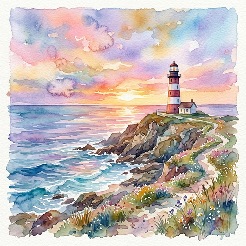

# Watercolor Painting

[← Back to Image Prompts](../README.md)

Fluid, translucent, and luminous watercolor art characterized by soft washes, visible color blooms, and delicate blending. This style captures the unpredictable and organic nature of water-based pigments on rough-pressed paper, perfect for conveying emotion, atmosphere, and natural beauty.

**Best for:** Landscapes · Botanical art · Children's book illustrations · Fashion sketches · Stationery · Dreamy concepts



---

## Prompt

Replace the bracketed details with your subject and preferred format.

```text
Watercolor painting of [SCENE — e.g., a coastal lighthouse at sunset], [FORMAT]. Lay transparent [PALETTE — e.g., rose, apricot, and cobalt] washes over cold-pressed paper, leaving bright paper-white highlights untouched. Let wet-on-wet edges bleed naturally through the sky and distant water, with soft blooms and granulation visible in the pigments. Use a few crisp dry-brush marks to anchor the focal subject against the loose atmospheric background. Luminous layered color and visible paper texture throughout.
```

## With a Reference Image

Attach your image and use this prompt to preserve its defining features while applying the style.

```text
Using the attached photo, transform it into a fluid watercolor painting. Soften the details into translucent color washes that bleed and blend organically. Add visible watercolor blooms, wet-on-wet painting effects, and occasional paint splatters. Set the artwork on a textured cold-pressed watercolor paper background.
```

---

## 💡 Tips & Best Practices
- **"Translucent washes" and "visible blooms"**: These are the hallmark characteristics of real watercolor that you must prompt for.
- **"Cold-pressed watercolor paper"**: Essential for getting the right canvas texture.
- **"Loose and expressive"**: Prevents the AI from making the watercolor look too tight, digital, or realistic.
- **Pairs well with:** [Soft Pastel](soft-pastel.md), [Botanical Illustration](botanical-illustration.md)
