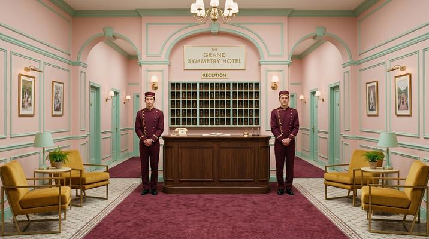

# Wes Anderson Symmetry

[← Back to Image Prompts](../README.md)

Perfectly centered compositions, pastel color palettes (pink, mint, mustard), dollhouse-like interiors, and whimsical typography. The meticulously designed visual world of *The Grand Budapest Hotel*, *Moonrise Kingdom*, and *The French Dispatch*. Every frame is obsessively composed — dead-center subjects, mirrored elements, and a curated palette where every color has been hand-selected. The style creates a heightened, storybook reality that feels simultaneously nostalgic and hyperreal.

**Best for:** Social media posts · Instagram content · Desktop wallpapers · Photography direction · Set design concepts · Brand lookbooks · Greeting cards



> **Sample prompt used to generate the above image (Nano Banana 2):**
> ```text
> Photograph of a perfectly symmetrical hotel lobby in the Wes Anderson visual style, 16:9 landscape format. Dead-center composition with the reception desk as the focal point. Pastel color palette — blush pink walls, mint-green trim, mustard-yellow velvet chairs, and a burgundy carpet runner leading straight to camera. Dollhouse-like interior with miniature brass mail slots on the back wall, a vintage rotary phone, and a bell on the counter. Two identical bellhops in matching uniforms stand on either side of the desk in mirror poses. Flat, even lighting with no dramatic shadows. Deadpan, symmetrical, obsessively composed.
> ```

---

## Prompt Variations

### 🔵 Nano Banana 2 _(Featured)_

> NB2 handles Wes Anderson's visual language well. The critical phrase is "perfectly symmetrical dead-center composition with elements mirrored on both sides." Always include "flat even lighting with no dramatic shadows" — Wes Anderson scenes are lit evenly to emphasize color and composition over mood.

**Variation 1 — Interior / Room** _(Instagram Post, Desktop Wallpaper)_
```text
Photograph in the Wes Anderson visual style of a [ROOM — e.g., vintage bookshop interior with floor-to-ceiling shelves, a rolling ladder, and a reading nook], 16:9 landscape format. Perfectly symmetrical dead-center composition. Curated pastel color palette — [PALETTE — e.g., dusty rose, sage green, cream, and caramel]. Dollhouse-like precision — every object precisely placed, shelves perfectly organized, spines color-coordinated. Flat even lighting with no dramatic shadows. Vintage details — brass fixtures, hand-lettered signage, worn leather. Deadpan, obsessively composed.
```

**Variation 2 — Exterior / Building Facade** _(Social Media, Print)_
```text
Photograph in the Wes Anderson visual style of a [BUILDING — e.g., pastel-colored apartment building facade with matching shutters, window boxes of flowers, and a centered entrance with an awning], 4:5 vertical format. Perfectly symmetrical facade — windows mirrored on both sides, identical planters, matching curtains. Curated pastel palette — [PALETTE — e.g., lemon yellow walls, baby blue shutters, coral awning, white trim]. Flat front-on composition shot dead-center. Clear sky as background. Vintage hand-painted sign above the entrance reading "[NAME]." Flat even lighting. Whimsical, precise.
```

**Variation 3 — Character Lineup** _(Social Media, Poster)_
```text
Photograph in the Wes Anderson visual style of [NUMBER] characters standing in a symmetrical row facing camera, 16:9 landscape format. Each character wears a carefully coordinated outfit in the pastel palette — [PALETTE — e.g., powder blue, mustard, blush pink, sage, and burgundy]. Deadpan expressions on every face. Characters arranged by height from center outward, perfectly mirrored. Background is a flat, solid [COLOR] wall. Flat even lighting. Centered composition. Each character holds one significant prop. Ensemble cast aesthetic from The Grand Budapest Hotel.
```

**Variation 4 — Overhead Flat Lay / Table Setting** _(Social Media, Product Photography)_
```text
Overhead flat-lay photograph in the Wes Anderson visual style of [SUBJECT — e.g., a precisely arranged breakfast table setting], 1:1 square format. Shot from directly above. Perfectly symmetrical arrangement — [DETAILS — e.g., matching plates and cups on either side, cutlery aligned with mathematical precision, a folded linen napkin with a handwritten note centered at the top]. Curated pastel palette — [PALETTE]. Every object precisely placed with equal spacing. Pastel tablecloth or surface. Flat even lighting with no shadows. Obsessively organized.
```

**Variation 5 — Travel / Transportation** _(Desktop Wallpaper, Print)_
```text
Photograph in the Wes Anderson visual style of [VEHICLE/SCENE — e.g., a vintage train car interior with plush velvet seats, curtained windows, and luggage racks], 16:9 landscape format. Perfectly symmetrical dead-center composition down the center aisle. Curated pastel palette — [PALETTE — e.g., burgundy velvet, gold trim, cream walls, forest green curtains]. Vintage details — brass fittings, monogrammed headrests, patterned carpet. Flat even lighting throughout the car. Whimsical, nostalgic. The Darjeeling Limited aesthetic.
```

### ChatGPT

**Variation 1 — Interior**
```text
Create a photograph in the Wes Anderson visual style of a [ROOM]. Perfectly symmetrical dead-center composition. Curated pastel palette — [PALETTE]. Dollhouse-like precision with every object placed. Flat even lighting. Vintage details. 16:9 landscape format.
```

**Variation 2 — Building Facade**
```text
Create a front-on photograph of a [BUILDING FACADE] in Wes Anderson style. Perfectly symmetrical with matching elements mirrored. Pastel palette — [PALETTE]. Flat composition. Hand-painted signage. 4:5 vertical format.
```

**Variation 3 — Character Lineup**
```text
Create a Wes Anderson-style photograph of [NUMBER] characters in a symmetrical row. Each in coordinated pastels — [PALETTE]. Deadpan expressions. Flat [COLOR] wall background. Even lighting. 16:9 landscape format.
```

### Midjourney

**Variation 1 — Interior**
```text
Wes Anderson style photograph, [ROOM], perfectly symmetrical, pastel palette [PALETTE], dollhouse precision, flat even lighting, vintage details, obsessively composed --ar 16:9 --s 200
```

**Variation 2 — Facade**
```text
Wes Anderson style, [BUILDING] facade, front-on symmetrical, pastel palette [PALETTE], matching windows and shutters, hand-painted sign, flat lighting --ar 4:5 --s 200
```

**Variation 3 — Overhead Flat Lay**
```text
Wes Anderson overhead flat lay, [SUBJECT], perfectly symmetrical arrangement, pastel palette, mathematical precision, flat even lighting, obsessively organized --ar 1:1 --s 200
```

### Stable Diffusion

**Variation 1 — Interior**
- **Prompt:** `Wes Anderson style photograph, [ROOM], perfectly symmetrical composition, pastel color palette, dollhouse interior, flat even lighting, vintage details, whimsical`
- **Negative Prompt:** `asymmetrical, dark, dramatic shadows, desaturated, gritty, handheld`

**Variation 2 — Facade**
- **Prompt:** `Wes Anderson style, [BUILDING] facade, front-on symmetrical, pastel palette, matching elements, flat lighting, vintage, whimsical`
- **Negative Prompt:** `asymmetrical, dark, dramatic, modern, gritty, handheld`

**Variation 3 — Character Lineup**
- **Prompt:** `Wes Anderson ensemble cast, [NUMBER] characters in row, symmetrical, coordinated pastels, deadpan, flat wall background, even lighting`
- **Negative Prompt:** `asymmetrical, dramatic lighting, action, dark, casual, candid`

---

## 🔄 Image-to-Image Transformations

Transform photos into Wes Anderson style:

**Nano Banana 2** _(Featured)_
```text
Using the attached photo as reference, restyle it in the visual world of Wes Anderson. Recompose for perfect symmetry — center the main subject with elements mirrored on both sides. Remap the color palette to curated pastels — [PALETTE]. Flatten the lighting to be even with no dramatic shadows. Add whimsical vintage details. Make every element feel precisely placed and obsessively composed. Deadpan, dollhouse-like, The Grand Budapest Hotel aesthetic. 16:9 landscape format.
```
> 💡 **Follow-up refinements:**
> - "Push the symmetry harder — mirror everything exactly"
> - "Change the palette to [NEW PASTELS]"
> - "Add hand-lettered signage or titles in the frame"
> - "Make it an overhead flat-lay version instead"

**ChatGPT**
```text
[Upload Photo] "Restyle this in Wes Anderson's visual style. Center the composition for perfect symmetry. Remap to pastels — [PALETTE]. Flat even lighting. Add vintage details. Obsessively composed."
```

**Midjourney**
```text
[IMAGE_URL] Wes Anderson visual style, perfectly symmetrical, curated pastel palette, flat even lighting, dollhouse precision, deadpan --iw 1.5 --ar 16:9 --s 200
```

**Stable Diffusion**
- **Pipeline:** Img2Img · Denoising Strength: `0.50–0.65` (moderate — preserves scene while adding palette and composition)
- **Prompt:** `Wes Anderson style, symmetrical, curated pastels, flat even lighting, dollhouse precision, vintage, whimsical`
- **Negative Prompt:** `asymmetrical, dark, dramatic, desaturated, gritty`

---

## 💡 Tips & Best Practices

- **Perfect symmetry is non-negotiable**: "Dead-center composition with elements mirrored on both sides." Even slight asymmetry breaks the Wes Anderson illusion.
- **Flat lighting defines the look**: "Flat even lighting with no dramatic shadows" prevents the gritty, moody lighting that fights the style. Anderson's world is evenly lit like a theater stage.
- **Curate your palette**: Don't just say "pastel" — name 4-5 specific colors. "Blush pink, mint green, mustard yellow, burgundy" is Wes Anderson. "Light blue" is not specific enough.
- **Vintage details ground it**: "Rotary phone," "brass mail slots," "hand-lettered signage," "monogrammed items" — these period details are essential.
- **Deadpan is the tone**: Characters should have neutral, deadpan expressions. Smiling or laughing breaks the Anderson aesthetic.
- **Common pitfalls**: "Colorful" alone doesn't equal Anderson. "Pastel" alone doesn't equal Anderson. It's symmetry + pastels + flat lighting + vintage detail + deadpan — all together.
- **Pairs well with:** [Art Deco Illustration](art-deco-illustration.md) (similar geometric obsession, different era), [Tilt-Shift Miniature](tilt-shift-miniature.md) (Anderson often uses tilt-shift in his films)
