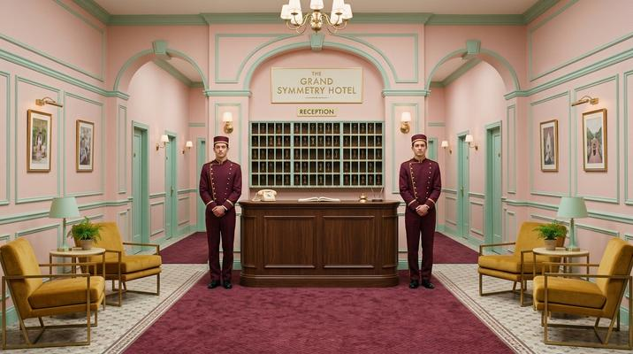

# Wes Anderson Symmetry

[← Back to Image Prompts](../README.md)

Perfectly centered compositions, pastel color palettes (pink, mint, mustard), dollhouse-like interiors, and whimsical typography. The meticulously designed visual world of *The Grand Budapest Hotel*, *Moonrise Kingdom*, and *The French Dispatch*. Every frame is obsessively composed — dead-center subjects, mirrored elements, and a curated palette where every color has been hand-selected. The style creates a heightened, storybook reality that feels simultaneously nostalgic and hyperreal.

**Best for:** Social media posts · Instagram content · Desktop wallpapers · Photography direction · Set design concepts · Brand lookbooks · Greeting cards



---

## Prompt

Replace the bracketed details with your subject and preferred format.

```text
Photograph in the Wes Anderson visual style of a [ROOM — e.g., vintage bookshop interior with floor-to-ceiling shelves, a rolling ladder, and a reading nook], 16:9 landscape format. Perfectly symmetrical dead-center composition. Curated pastel color palette — [PALETTE — e.g., dusty rose, sage green, cream, and caramel]. Dollhouse-like precision — every object precisely placed, shelves perfectly organized, spines color-coordinated. Flat even lighting with no dramatic shadows. Vintage details — brass fixtures, hand-lettered signage, worn leather. Deadpan, obsessively composed.
```

## With a Reference Image

Attach your image and use this prompt to preserve its defining features while applying the style.

```text
Using the attached photo as reference, restyle it in the visual world of Wes Anderson. Recompose for perfect symmetry — center the main subject with elements mirrored on both sides. Remap the color palette to curated pastels — [PALETTE]. Flatten the lighting to be even with no dramatic shadows. Add whimsical vintage details. Make every element feel precisely placed and obsessively composed. Deadpan, dollhouse-like, The Grand Budapest Hotel aesthetic. 16:9 landscape format.
```

---

## 💡 Tips & Best Practices

- **Perfect symmetry is non-negotiable**: "Dead-center composition with elements mirrored on both sides." Even slight asymmetry breaks the Wes Anderson illusion.
- **Flat lighting defines the look**: "Flat even lighting with no dramatic shadows" prevents the gritty, moody lighting that fights the style. Anderson's world is evenly lit like a theater stage.
- **Curate your palette**: Don't just say "pastel" — name 4-5 specific colors. "Blush pink, mint green, mustard yellow, burgundy" is Wes Anderson. "Light blue" is not specific enough.
- **Vintage details ground it**: "Rotary phone," "brass mail slots," "hand-lettered signage," "monogrammed items" — these period details are essential.
- **Deadpan is the tone**: Characters should have neutral, deadpan expressions. Smiling or laughing breaks the Anderson aesthetic.
- **Common pitfalls**: "Colorful" alone doesn't equal Anderson. "Pastel" alone doesn't equal Anderson. It's symmetry + pastels + flat lighting + vintage detail + deadpan — all together.
- **Pairs well with:** [Art Deco Illustration](art-deco-illustration.md) (similar geometric obsession, different era), [Tilt-Shift Miniature](tilt-shift-miniature.md) (Anderson often uses tilt-shift in his films)
