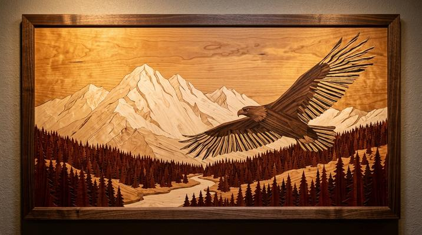

# Wooden Marquetry / Intarsia

[← Back to Image Prompts](../README.md)

Scenes composed entirely from different wood veneers — walnut, maple, cherry, ebony, padauk, zebrawood — where the natural grain direction changes define each shape. A warm, handcrafted fine woodworking aesthetic where the artist's medium is inherently limited: no paint, no dye, only the natural colors and grain patterns of real wood species. This constraint produces a beautiful, warm-toned elegance that feels both ancient and refined.

**Best for:** Art prints · Desktop wallpapers · Social media posts · Gift art · Home décor mockups · Logo concepts · Book covers



> **Sample prompt used to generate the above image (Nano Banana 2):**
> ```text
> Photograph of a wooden marquetry artwork depicting a majestic eagle in flight over a mountainous forest landscape, 16:9 landscape format. The entire image is composed from precisely cut and fitted wood veneers — the eagle's body in rich dark walnut with grain lines following the feather direction, wings in striped zebrawood, mountains in pale maple, sky in honey-toned cherry, and pine trees in deep mahogany. Each piece is cut with razor-sharp precision and fitted seamlessly. The natural wood grain direction changes at every boundary, creating visual contrast. Finished with a satin lacquer that deepens the grain colors. Studio lighting with a warm amber tone emphasizing the wood's natural luster.
> ```

---

## Prompt Variations

### 🔵 Nano Banana 2 _(Featured)_

> NB2 renders wood grain with remarkable detail. The key phrase is "natural wood grain direction changes at every boundary between pieces" — this creates the visual contrast that defines marquetry. Always name specific wood species for each element.

**Variation 1 — Wildlife / Animal Portrait** _(Art Print, Wall Art)_
```text
Photograph of a wooden marquetry artwork depicting [SUBJECT — e.g., a wolf howling at a full moon in a winter forest], 16:9 landscape format. The entire image composed from precisely cut wood veneers — [WOOD ASSIGNMENTS — e.g., the wolf in dark walnut with grain following the fur direction, moon in pale birch, sky in deep mahogany, snow-covered ground in light maple, pine trees in rosewood]. Each piece cut with razor-sharp precision and fitted seamlessly. Natural wood grain direction changes at every boundary. Satin lacquer finish deepening grain colors. Warm amber studio lighting.
```

**Variation 2 — Cityscape / Architecture** _(Desktop Wallpaper, Social Media)_
```text
Photograph of a wooden marquetry artwork depicting [SCENE — e.g., a Paris skyline at dusk with the Eiffel Tower, rooftops, and the Seine River], 16:9 landscape format. Composed from precisely cut wood veneers — [ASSIGNMENTS — e.g., sky in graduated cherry to dark walnut for the dusk transition, buildings in various oaks and maples with grain lines following the architectural lines, river in striped zebrawood reflecting horizontal grain, the tower in ebony]. Grain direction changes at every boundary. Satin lacquer finish. Warm amber studio lighting.
```

**Variation 3 — Botanical / Floral** _(Greeting Card, Home Décor)_
```text
Photograph of a wooden marquetry artwork depicting [DESIGN — e.g., a bouquet of roses and peonies in a classical vase], 4:5 vertical format. Each petal is a separate piece of veneer — [ASSIGNMENTS — e.g., rose petals in padauk and bloodwood showing warm reds, peony petals in pale sycamore and holly, leaves in satinwood and green-tinted poplar, vase in figured maple burl, background in plain walnut]. Grain lines follow the natural curves of each petal. Razor-sharp precision, seamless fit. Satin lacquer. Warm studio lighting.
```

**Variation 4 — Portrait / Face** _(Art Print, Gift)_
```text
Photograph of a wooden marquetry portrait depicting [SUBJECT — e.g., a woman in profile with flowing hair against a moonlit sky], 4:5 vertical format. Skin tones achieved through careful selection of pale veneers — [ASSIGNMENTS — e.g., face in honey-toned pearwood, hair in dark walnut with grain following the flow, lips in padauk, eye in ebony and holly, moonlight sky in graduated birch to cherry]. Each feature defined by the grain direction change at piece boundaries. Master-level precision. Satin lacquer finish. Warm directional studio lighting.
```

**Variation 5 — Geometric / Abstract** _(Logo Concept, Modern Décor)_
```text
Photograph of a wooden marquetry artwork featuring a geometric abstract design — [PATTERN — e.g., concentric hexagons radiating outward from a central point, each ring a different wood species], 1:1 square format. Woods include [LIST — e.g., walnut, maple, cherry, wenge, padauk, zebrawood, and holly]. The grain direction rotates 30 degrees with each ring, creating a mesmerizing radiating pattern. Mathematically precise cuts. Satin lacquer finish enhancing the warm natural color variation. Clean studio lighting with soft shadows.
```

### ChatGPT

**Variation 1 — Wildlife**
```text
Create a photograph of a wooden marquetry artwork depicting [SUBJECT]. The image is composed entirely from precisely cut wood veneers — assign different species to each element: [WOOD ASSIGNMENTS]. Each piece cut with precision, grain direction changing at every boundary. Satin lacquer finish. Warm amber studio lighting. 16:9 landscape format.
```

**Variation 2 — Botanical**
```text
Create a photograph of a wooden marquetry floral artwork: [DESIGN]. Each petal is a separate veneer piece in [WOOD SPECIES]. Grain lines follow natural petal curves. Razor-sharp precision. Satin lacquer. Warm lighting. 4:5 vertical format.
```

**Variation 3 — Geometric**
```text
Create a photograph of a geometric marquetry design: [PATTERN]. Multiple wood species — [LIST]. Grain direction creates visual rhythm. Precise cuts. Satin lacquer. Studio lighting. 1:1 square format.
```

### Midjourney

**Variation 1 — Wildlife**
```text
Wooden marquetry artwork, [SUBJECT], precisely cut wood veneers, walnut maple cherry ebony, natural grain direction changes, satin lacquer finish, warm amber studio lighting --ar 16:9
```

**Variation 2 — Cityscape**
```text
Wooden marquetry cityscape, [SCENE], cut wood veneers, grain follows architectural lines, multiple wood species, satin lacquer, warm lighting --ar 16:9
```

**Variation 3 — Botanical**
```text
Wooden marquetry floral, [DESIGN], each petal separate veneer, grain follows curves, multiple wood species, satin lacquer, warm studio lighting --ar 4:5
```

### Stable Diffusion

**Variation 1 — Wildlife**
- **Prompt:** `Wooden marquetry intarsia artwork, [SUBJECT], precisely cut wood veneers, walnut maple cherry ebony, grain direction changes, satin lacquer, warm studio lighting, 8k`
- **Negative Prompt:** `painted wood, smooth, digital, illustration, blurry, text`

**Variation 2 — Portrait**
- **Prompt:** `Wooden marquetry portrait, [SUBJECT], wood veneers for skin tones, grain following features, pearwood walnut padauk, satin lacquer, warm lighting, 8k`
- **Negative Prompt:** `painted, digital, illustration, smooth, flat, photograph of person`

**Variation 3 — Geometric**
- **Prompt:** `Geometric wooden marquetry, [PATTERN], multiple wood species, rotating grain directions, precise cuts, satin lacquer, studio lighting, 8k`
- **Negative Prompt:** `painted, illustration, digital, rough, unfinished`

---

## 🔄 Image-to-Image Transformations

Transform photos into wooden marquetry:

**Nano Banana 2** _(Featured)_
```text
Using the attached photo as reference, recreate the entire image as a wooden marquetry artwork. Assign different wood veneer species to each major element based on the original colors — darker areas in walnut or ebony, lighter areas in maple or birch, warm tones in cherry or padauk. The natural wood grain direction should follow the contours of each element. Every boundary between elements shows a grain direction change. Satin lacquer finish. Warm amber studio lighting. Preserve the original composition.
```
> 💡 **Follow-up refinements:**
> - "Use more exotic wood species — zebrawood, purpleheart, tiger maple"
> - "Add a decorative geometric border around the edge"
> - "Make the grain lines more visible and pronounced"
> - "Show it installed in a wooden frame on a wall for a mockup"

**ChatGPT**
```text
[Upload Photo] "Recreate this image as a wooden marquetry artwork. Assign wood veneer species to each element by color — dark areas in walnut, light in maple, warm tones in cherry. Grain direction changes at every boundary. Satin lacquer finish. Warm studio lighting."
```

**Midjourney**
```text
[IMAGE_URL] Wooden marquetry artwork, precisely cut veneers, multiple wood species, grain direction changes, satin lacquer finish, warm amber lighting --iw 1.5 --ar 16:9
```

**Stable Diffusion**
- **Pipeline:** Img2Img · Denoising Strength: `0.65–0.80`
- **Prompt:** `Wooden marquetry artwork, cut wood veneers, multiple species, grain direction changes, satin lacquer, warm studio lighting, 8k`
- **Negative Prompt:** `painted, digital, illustration, smooth, photograph`

---

## 💡 Tips & Best Practices

- **Name specific wood species**: "Walnut," "maple," "cherry," "ebony," "padauk," "zebrawood" — each has a distinct color and grain. Generic "wood" produces fuzzy, unconvincing results.
- **Grain direction is the style**: "Natural wood grain direction changes at every boundary between pieces" is the phrase that makes it read as marquetry rather than a wood-textured illustration.
- **Satin lacquer finish**: This deepens the grain colors and adds warmth. Without it, the wood looks raw and dusty.
- **Assign woods by color**: Map your subject's color palette to real wood species — dark = walnut/ebony, light = maple/birch, red = padauk/bloodwood, yellow = satinwood.
- **Common pitfalls**: Don't say "painted on wood" — marquetry uses no paint. Don't use "wood texture overlay" — the image must be *made from* wood pieces, not printed on wood.
- **Pairs well with:** [Paper Cutout / Kirigami](paper-cutout-kirigami.md) (similar inlaid craft, different material), [Botanical Illustration](botanical-illustration.md) (botanical subjects work beautifully in both styles)
