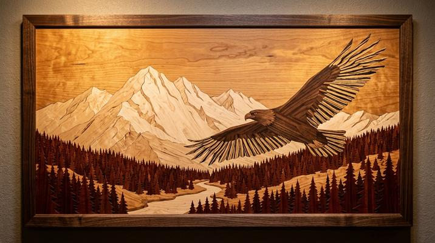

# Wooden Marquetry / Intarsia

[← Back to Image Prompts](../README.md)

Scenes composed entirely from different wood veneers — walnut, maple, cherry, ebony, padauk, zebrawood — where the natural grain direction changes define each shape. A warm, handcrafted fine woodworking aesthetic where the artist's medium is inherently limited: no paint, no dye, only the natural colors and grain patterns of real wood species. This constraint produces a beautiful, warm-toned elegance that feels both ancient and refined.

**Best for:** Art prints · Desktop wallpapers · Social media posts · Gift art · Home décor mockups · Logo concepts · Book covers



---

## Prompt

Replace the bracketed details with your subject and preferred format.

```text
Photograph of a wooden marquetry artwork depicting [SUBJECT — e.g., a wolf howling at a full moon in a winter forest], 16:9 landscape format. The entire image composed from precisely cut wood veneers — [WOOD ASSIGNMENTS — e.g., the wolf in dark walnut with grain following the fur direction, moon in pale birch, sky in deep mahogany, snow-covered ground in light maple, pine trees in rosewood]. Each piece cut with razor-sharp precision and fitted seamlessly. Natural wood grain direction changes at every boundary. Satin lacquer finish deepening grain colors. Warm amber studio lighting.
```

## With a Reference Image

Attach your image and use this prompt to preserve its defining features while applying the style.

```text
Using the attached photo as reference, recreate the entire image as a wooden marquetry artwork. Assign different wood veneer species to each major element based on the original colors — darker areas in walnut or ebony, lighter areas in maple or birch, warm tones in cherry or padauk. The natural wood grain direction should follow the contours of each element. Every boundary between elements shows a grain direction change. Satin lacquer finish. Warm amber studio lighting. Preserve the original composition.
```

---

## 💡 Tips & Best Practices

- **Name specific wood species**: "Walnut," "maple," "cherry," "ebony," "padauk," "zebrawood" — each has a distinct color and grain. Generic "wood" produces fuzzy, unconvincing results.
- **Grain direction is the style**: "Natural wood grain direction changes at every boundary between pieces" is the phrase that makes it read as marquetry rather than a wood-textured illustration.
- **Satin lacquer finish**: This deepens the grain colors and adds warmth. Without it, the wood looks raw and dusty.
- **Assign woods by color**: Map your subject's color palette to real wood species — dark = walnut/ebony, light = maple/birch, red = padauk/bloodwood, yellow = satinwood.
- **Common pitfalls**: Don't say "painted on wood" — marquetry uses no paint. Don't use "wood texture overlay" — the image must be *made from* wood pieces, not printed on wood.
- **Pairs well with:** [Paper Cutout / Kirigami](paper-cutout-kirigami.md) (similar inlaid craft, different material), [Botanical Illustration](botanical-illustration.md) (botanical subjects work beautifully in both styles)
