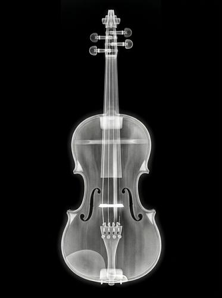

# X-Ray / Medical Imaging

[← Back to Image Prompts](../README.md)

The ghostly translucency of X-ray, CT scan, and MRI imaging — where the external disappears and internal structures are revealed. Dense materials (bone, metal) appear bright white, soft tissue appears in grey gradients, and air appears black. The style strips away all surface detail to expose the hidden architecture underneath, creating images that are simultaneously clinical and hauntingly beautiful.

**Best for:** Art prints · Desktop wallpapers · Social media posts · Educational content · Poster prints · Album covers · Conceptual art



> **Sample prompt used to generate the above image (Nano Banana 2):**
> ```text
> X-ray radiograph of a pair of canvas sneakers viewed from the side, on a pure black background, 16:9 landscape format. The canvas fabric is faintly translucent grey, revealing the internal structure — rubber sole layers, metal eyelets as bright white rings, metal zipper pull, the heel counter, and the shoe's internal foam padding. The laces appear as thin grey strands threading through bright white eyelets. Typical X-ray tonal range — bright white for dense materials, grey gradients for soft materials, black for air. Medical imaging lightbox aesthetic.
> ```

---

## Prompt Variations

### 🔵 Nano Banana 2 _(Featured)_

**Variation 1 — Object / Product** — X-ray of [OBJECT], translucent exterior revealing internal mechanisms, bone-white for dense parts, grey gradients for soft, black background, medical aesthetic, [FORMAT].

**Variation 2 — Botanical / Nature** — X-ray of [FLOWER/PLANT], translucent petals and leaves showing vein structures, stem cross-section visible, delicate grey tones, black background, [FORMAT].

**Variation 3 — Animal / Anatomical** — X-ray of [ANIMAL], skeletal structure visible, graduated density rendering, anatomical accuracy, black background, medical imaging, [FORMAT].

**Variation 4 — Collection / Still Life** — X-ray of [COLLECTION — e.g., a handbag's contents / toolbox / suitcase], revealing hidden objects inside, varying densities, black background, airport-security / forensic aesthetic, [FORMAT].

**Variation 5 — Portrait / Human** — X-ray-style portrait of [SUBJECT], skull structure visible through translucent skin, dental work bright white, soft tissue as grey, black background, clinical beauty, [FORMAT].

### ChatGPT / Midjourney / Stable Diffusion — Standard templates with "X-ray radiograph, translucent, internal structure visible, bright white for dense, grey gradients, black background, medical imaging" core keywords.

---

## 🔄 Image-to-Image Transformations

**Nano Banana 2** _(Featured)_
```text
Using the attached photo, transform it into an X-ray radiograph. Make the exterior translucent to reveal internal structures. Dense materials (bone, metal, hard plastic) appear bright white. Soft materials appear as grey gradients. Air is pure black. Strip away all color and surface texture — only density matters. Pure black background. Medical imaging lightbox aesthetic.
```

---

## 💡 Tips & Best Practices
- **Density = brightness**: "Dense materials bright white, soft materials grey, air black" — this IS the physics of X-ray.
- **Translucency reveals structure**: The subject's exterior should be see-through, showing what's hidden inside.
- **Black background**: X-rays are always on a pure black (lightbox) background.
- **Pairs well with:** [Electron Microscope](electron-microscope.md) (both reveal hidden structures), [Frosted Glass / Ice Sculpture](frosted-glass-ice-sculpture.md) (similar transparency aesthetic)
