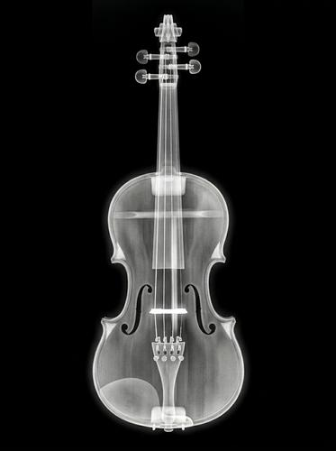

# X-Ray / Medical Imaging

[← Back to Image Prompts](../README.md)

The ghostly translucency of X-ray, CT scan, and MRI imaging — where the external disappears and internal structures are revealed. Dense materials (bone, metal) appear bright white, soft tissue appears in grey gradients, and air appears black. The style strips away all surface detail to expose the hidden architecture underneath, creating images that are simultaneously clinical and hauntingly beautiful.

**Best for:** Art prints · Desktop wallpapers · Social media posts · Educational content · Poster prints · Album covers · Conceptual art



> **Sample prompt used to generate the above image (Nano Banana 2):**
> ```text
> X-ray radiograph of a pair of canvas sneakers viewed from the side, on a pure black background, 16:9 landscape format. The canvas fabric is faintly translucent grey, revealing the internal structure — rubber sole layers, metal eyelets as bright white rings, metal zipper pull, the heel counter, and the shoe's internal foam padding. The laces appear as thin grey strands threading through bright white eyelets. Typical X-ray tonal range — bright white for dense materials, grey gradients for soft materials, black for air. Medical imaging lightbox aesthetic.
> ```

---

## Prompt Variations

### 🔵 Nano Banana 2 _(Featured)_

**Variation 1 — Object / Product** _(Conceptual Art)_
```text
X-ray of [OBJECT], translucent exterior revealing internal mechanisms, bone-white for dense parts, grey gradients for soft, black background, medical aesthetic, [FORMAT].
```

**Variation 2 — Botanical / Nature** _(Stationery)_
```text
X-ray of [FLOWER/PLANT], translucent petals and leaves showing vein structures, stem cross-section visible, delicate grey tones, black background, [FORMAT].
```

**Variation 3 — Animal / Anatomical** _(Art Print)_
```text
X-ray of [ANIMAL], skeletal structure visible, graduated density rendering, anatomical accuracy, black background, medical imaging, [FORMAT].
```

**Variation 4 — Collection / Still Life** _(Art Print)_
```text
X-ray of [COLLECTION — e.g., a handbag's contents / toolbox / suitcase], revealing hidden objects inside, varying densities, black background, airport-security / forensic aesthetic, [FORMAT].
```

**Variation 5 — Portrait / Human** _(Profile Picture)_
```text
X-ray-style portrait of [SUBJECT], skull structure visible through translucent skin, dental work bright white, soft tissue as grey, black background, clinical beauty, [FORMAT].
```

### ChatGPT

**Variation 1 — Object / Product** _(Conceptual Art)_
```text
Create an X-ray radiograph of [OBJECT] on a pure black background — the exterior translucent grey, revealing internal mechanisms and structure. Dense materials (metal, hard plastic) appear bright white, soft materials in grey gradients, air pure black. Medical imaging lightbox aesthetic. 16:9 landscape format.
```

**Variation 2 — Botanical / Nature** _(Art Print)_
```text
Create an X-ray image of [FLOWER/PLANT] — translucent petals and leaves revealing delicate vein structures, the stem's internal layers visible, soft grey tonal gradients on a pure black background. Hauntingly beautiful and clinical. 3:4 vertical format.
```

**Variation 3 — Collection / Still Life** _(Poster)_
```text
Create an X-ray of [COLLECTION — e.g., a handbag's contents] revealing the hidden objects inside — varying densities rendered from bright white to translucent grey, airport-security/forensic aesthetic, pure black background. 1:1 square format.
```

### Midjourney

**Variation 1 — Object / Product** _(Conceptual Art)_
```text
X-ray radiograph of [OBJECT], translucent exterior revealing internal structure, bright white dense materials, grey gradient soft materials, pure black background, medical imaging --ar 16:9 --s 100
```

**Variation 2 — Botanical / Nature** _(Art Print)_
```text
X-ray image of [FLOWER/PLANT], translucent petals, visible vein structures, delicate grey tones, pure black background, clinical beauty --ar 3:4 --s 150
```

**Variation 3 — Animal / Anatomical** _(Educational Content)_
```text
X-ray of [ANIMAL], skeletal structure visible, graduated density rendering, anatomical accuracy, black background, medical imaging aesthetic --ar 3:2 --s 100
```

### Stable Diffusion

**Variation 1 — Object / Product** _(Conceptual Art)_
- **Prompt:** `X-ray radiograph, [OBJECT], translucent exterior, internal structure visible, bright white dense materials, grey gradients, pure black background, medical imaging lightbox`
- **Negative Prompt:** `color, surface texture, photograph, painting, low quality`

**Variation 2 — Botanical / Nature** _(Art Print)_
- **Prompt:** `X-ray image, [FLOWER/PLANT], translucent petals, vein structures visible, delicate grey tonal gradients, black background, radiograph`
- **Negative Prompt:** `color, opaque, natural photograph, oversharpened, blur`

---

## 🔄 Image-to-Image Transformations

**Nano Banana 2** _(Featured)_
```text
Using the attached photo, transform it into an X-ray radiograph. Make the exterior translucent to reveal internal structures. Dense materials (bone, metal, hard plastic) appear bright white. Soft materials appear as grey gradients. Air is pure black. Strip away all color and surface texture — only density matters. Pure black background. Medical imaging lightbox aesthetic.
```

**ChatGPT**
```text
[Upload Photo] "Transform this photo into an X-ray radiograph — translucent exterior revealing internal structure, dense materials bright white, soft materials in grey gradients, air pure black, on a black lightbox background."
```

**Midjourney**
```text
[IMAGE_URL] X-ray radiograph, translucent exterior, internal structure visible, bright white dense materials, grey gradients, pure black background, medical imaging --iw 1 --ar 16:9
```

**Stable Diffusion**
- **Pipeline:** Img2Img · Denoising Strength: `0.6–0.75` (re-renders as density map)
- **Prompt:** `X-ray radiograph, translucent, internal structure visible, bright white dense materials, grey gradients, black background, medical imaging`
- **Negative Prompt:** `color, surface detail, natural photograph, painting`

---

## 💡 Tips & Best Practices
- **Density = brightness**: "Dense materials bright white, soft materials grey, air black" — this IS the physics of X-ray.
- **Translucency reveals structure**: The subject's exterior should be see-through, showing what's hidden inside.
- **Black background**: X-rays are always on a pure black (lightbox) background.
- **Pairs well with:** [Electron Microscope](electron-microscope.md) (both reveal hidden structures), [Frosted Glass / Ice Sculpture](frosted-glass-ice-sculpture.md) (similar transparency aesthetic)
