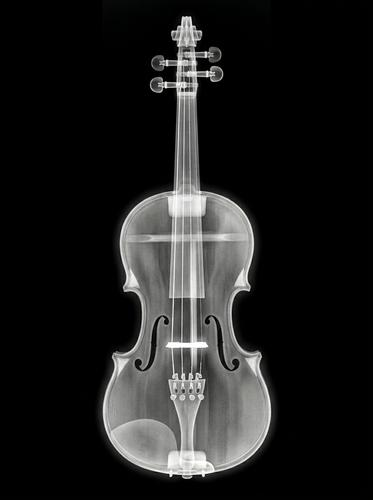

# X-Ray / Medical Imaging

[← Back to Image Prompts](../README.md)

The ghostly translucency of X-ray, CT scan, and MRI imaging — where the external disappears and internal structures are revealed. Dense materials (bone, metal) appear bright white, soft tissue appears in grey gradients, and air appears black. The style strips away all surface detail to expose the hidden architecture underneath, creating images that are simultaneously clinical and hauntingly beautiful.

**Best for:** Art prints · Desktop wallpapers · Social media posts · Educational content · Poster prints · Album covers · Conceptual art



---

## Prompt

Replace the bracketed details with your subject and preferred format.

```text
X-ray radiograph of [OBJECT — e.g., a canvas sneaker viewed from the side], [FORMAT]. Make the outer material faintly translucent grey, revealing plausible internal layers and components; show dense parts such as [DENSE DETAILS — e.g., metal eyelets and a zipper pull] as bright white, softer foam or fabric as graded grey, and empty air as black. Preserve the object's recognizable silhouette and accurate internal placement. Frame it against a pure black medical lightbox field with crisp tonal separation and fine imaging grain.
```

## With a Reference Image

Attach your image and use this prompt to preserve its defining features while applying the style.

```text
Using the attached photo, transform it into an X-ray radiograph. Make the exterior translucent to reveal internal structures. Dense materials (bone, metal, hard plastic) appear bright white. Soft materials appear as grey gradients. Air is pure black. Strip away all color and surface texture — only density matters. Pure black background. Medical imaging lightbox aesthetic.
```

---

## 💡 Tips & Best Practices
- **Density = brightness**: "Dense materials bright white, soft materials grey, air black" — this IS the physics of X-ray.
- **Translucency reveals structure**: The subject's exterior should be see-through, showing what's hidden inside.
- **Black background**: X-rays are always on a pure black (lightbox) background.
- **Pairs well with:** [Electron Microscope](electron-microscope.md) (both reveal hidden structures), [Frosted Glass / Ice Sculpture](frosted-glass-ice-sculpture.md) (similar transparency aesthetic)
