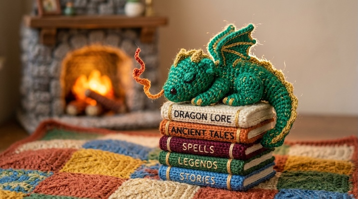

# Made of Yarn / Amigurumi

[← Back to Image Prompts](../README.md)

Cozy, tactile scenes where everything — characters, environments, and props — is crafted from knitted and crocheted yarn with individually visible stitches, fuzzy fiber edges, and warm directional lighting. The amigurumi aesthetic transforms any subject into an irresistibly soft, huggable version of itself. Every element shares the same material language: yarn, stitches, fabric, thread — nothing breaks the textile illusion.

**Best for:** Children's content · Social media posts · Product mockups · Holiday cards · Desktop wallpapers · Merchandise designs · Nursery art



> **Sample prompt used to generate the above image (Nano Banana 2):**
> ```text
> Macro photograph of a tiny crocheted baby dragon sleeping on top of a stack of miniature knitted books, 16:9 landscape format. The dragon is made from emerald-green and gold yarn with individually visible stitches and tiny fuzzy fibers catching the light along its wings. One nostril releases a single wisp of crocheted orange "flame" yarn. The books have different colored yarn spines. Everything sits on a knitted patchwork quilt. Soft warm directional lighting from a miniature yarn fireplace glowing in the background.
> ```

---

## Prompt Variations

### 🔵 Nano Banana 2 _(Featured)_

> NB2 excels at rendering textile textures. The essential phrase is "individually visible stitches with tiny fuzzy fibers catching the light along the edges." Also specify that *everything* in the scene is made of yarn — without this, AI models tend to mix real and yarn elements.

**Variation 1 — Character Portrait** _(Profile Picture, Social Media)_
```text
Macro photograph of an adorable amigurumi crocheted doll of [SUBJECT — e.g., a fox wearing a tiny knitted scarf], 1:1 square portrait format. Every individual stitch is visible across the yarn surface, with tiny fuzzy fibers catching the light at the edges. Button eyes with slight gloss. Sitting on a knitted [SURFACE — e.g., patchwork blanket]. Soft warm directional lighting emphasizing the cozy textile texture. Background is a softly blurred yarn [ENVIRONMENT — e.g., miniature yarn living room]. Everything in the frame is made of yarn, thread, or fabric.
```

**Variation 2 — Full Scene / Diorama** _(Desktop Wallpaper, Social Media)_
```text
Macro photograph of a complete amigurumi scene — [SCENE — e.g., a tiny yarn village with crocheted cottages, knitted trees, and a braided river made of blue ribbon yarn], 16:9 landscape format. Every element crafted entirely from yarn — buildings, vegetation, ground, sky. Individually visible stitches on every surface with fuzzy fiber edges catching the light. Multiple yarn colors and textures — chunky wool for buildings, fine crochet for details, ribbon yarn for water. Warm golden-hour directional lighting casting soft shadows across the textile landscape.
```

**Variation 3 — Holiday / Seasonal** _(Greeting Card, Social Media)_
```text
Macro photograph of an amigurumi [HOLIDAY — e.g., Christmas] scene — [DETAILS — e.g., a crocheted Christmas tree decorated with tiny knitted ornaments and a yarn star on top, surrounded by miniature wrapped presents made from patterned fabric scraps and yarn bows], 4:5 vertical format. Every element is yarn, thread, or fabric. Individually visible stitches with fuzzy fibers. Warm tungsten lighting from [LIGHT SOURCE — e.g., a tiny knitted fireplace with orange yarn "flames"]. Cozy, festive, handmade charm.
```

**Variation 4 — Animal / Pet Portrait** _(Social Media, Nursery Art)_
```text
Macro photograph of an amigurumi crocheted [ANIMAL — e.g., golden retriever puppy] in a playful pose — [POSE — e.g., lying on its back with paws in the air, tongue (pink yarn) hanging out], 1:1 square format. The animal is crafted from [COLOR] yarn with individually visible stitches. Fuzzy mohair yarn used for fluffy areas (ears, tail, chest). Button or safety eyes with a slight gloss. Sitting on a knitted [SURFACE]. Soft warm studio lighting. Close-up macro composition showing stitch detail.
```

**Variation 5 — Pattern / Repeating Design** _(Textile Design, Merchandise)_
```text
Macro photograph of a knitted textile pattern featuring a repeating motif of [MOTIF — e.g., interlocked foxes and oak leaves in a Scandinavian Fair Isle style], seamless tileable pattern, 1:1 square format. Rendered as actual knitted yarn on cream-colored knit fabric — individually visible V-shaped knit stitches forming the pattern. Colors limited to [PALETTE — e.g., rust orange, forest green, cream, and charcoal]. Flat composition shot directly from above. Soft even lighting showing the raised texture of the color-change knitting. Visible fabric stretch and yarn density variation.
```

### ChatGPT

**Variation 1 — Character Portrait**
```text
Create a macro photograph of an adorable amigurumi crocheted doll of [SUBJECT]. Every stitch individually visible with fuzzy fibers catching the light. Button eyes. Sitting on a knitted [SURFACE]. Everything in the scene is made of yarn. Soft warm directional lighting. 1:1 square format.
```

**Variation 2 — Full Scene**
```text
Create a macro photograph of a complete amigurumi yarn scene: [SCENE]. Every element — buildings, vegetation, ground — crafted from yarn. Visible stitches with fuzzy edges. Multiple yarn textures. Warm golden-hour lighting. 16:9 landscape format.
```

**Variation 3 — Holiday**
```text
Create a macro photograph of an amigurumi [HOLIDAY] scene: [DETAILS]. All yarn, thread, and fabric. Visible stitches. Warm firelight glow. Cozy, festive, handmade charm. 4:5 vertical format.
```

### Midjourney

**Variation 1 — Character Portrait**
```text
Macro photograph of an amigurumi crocheted doll of [SUBJECT], visible individual stitches, fuzzy fiber edges, button eyes, knitted [SURFACE], all yarn, warm directional lighting --ar 1:1
```

**Variation 2 — Full Scene**
```text
Macro photograph, amigurumi yarn scene, [SCENE], every element made of yarn, visible stitches, fuzzy edges, multiple yarn textures, warm golden-hour lighting --ar 16:9
```

**Variation 3 — Animal**
```text
Macro photograph, amigurumi crocheted [ANIMAL], [POSE], visible stitches, mohair fuzzy details, button eyes, knitted surface, warm studio lighting --ar 1:1
```

### Stable Diffusion

**Variation 1 — Character**
- **Prompt:** `Macro photograph of amigurumi crochet doll of [SUBJECT], visible individual stitches, fuzzy fiber edges, button eyes, knitted surface, all yarn, warm lighting, 8k`
- **Negative Prompt:** `plastic, smooth, real person, flat lighting, illustration`

**Variation 2 — Scene**
- **Prompt:** `Macro photograph, amigurumi yarn scene, [SCENE], every element yarn, visible stitches, fuzzy edges, multiple textures, warm golden-hour lighting, 8k`
- **Negative Prompt:** `real objects, plastic, smooth, photograph of real scene, flat`

**Variation 3 — Holiday**
- **Prompt:** `Macro photograph, amigurumi [HOLIDAY] scene, yarn and fabric, visible stitches, warm tungsten lighting, cozy festive, handmade, 8k`
- **Negative Prompt:** `plastic, real objects, smooth, cold, dark, horror`

---

## 🔄 Image-to-Image Transformations

Transform photos into yarn/amigurumi versions:

**Nano Banana 2** _(Featured)_
```text
Using the attached photo as reference, transform the entire scene into an amigurumi yarn world. Convert every person into a crocheted yarn doll with individually visible stitches and button eyes. Rebuild every object, surface, and background element from yarn, thread, or fabric. Preserve the original composition, poses, and color palette. Add warm directional lighting that emphasizes the textile texture. Fuzzy fiber edges catching the light throughout.
```
> 💡 **Follow-up refinements:**
> - "Make the stitches more visible — bigger yarn, chunkier texture"
> - "Add a wooden embroidery hoop framing the whole scene"
> - "Change from crochet to knit texture"
> - "Make only the person yarn — keep the background photorealistic"

**ChatGPT**
```text
[Upload Photo] "Transform this entire scene into an amigurumi yarn world. Convert people into crocheted dolls with visible stitches and button eyes. Rebuild all objects from yarn and fabric. Warm directional lighting."
```

**Midjourney**
```text
[IMAGE_URL] Amigurumi yarn world, crocheted dolls, every element made of yarn, visible stitches, button eyes, fuzzy fibers, warm lighting --iw 1.5 --ar 16:9
```

**Stable Diffusion**
- **Pipeline:** Img2Img · Denoising Strength: `0.65–0.80`
- **Prompt:** `Amigurumi yarn world, crocheted dolls, visible stitches, button eyes, all yarn and fabric, warm directional lighting, macro, 8k`
- **Negative Prompt:** `real person, smooth, plastic, photograph, flat`

---

## 💡 Tips & Best Practices

- **"Everything in the scene is made of yarn"**: Without this explicit instruction, AI models mix real and yarn objects. Be absolute.
- **Stitch visibility is everything**: "Individually visible stitches" is the single most important phrase. Without it, surfaces look smooth and plastic rather than handcrafted.
- **Fuzzy fibers sell the material**: "Tiny fuzzy fibers catching the light along the edges" creates that authentic yarn halo effect.
- **Button eyes vs. embroidered eyes**: Button eyes create a more classic amigurumi look. Specify "safety eyes" or "embroidered French knot eyes" for variations.
- **Lighting direction matters**: Yarn texture is revealed by directional light. "Flat lighting" kills the textile effect. Always use warm side-lighting.
- **Common pitfalls**: Avoid "soft toy" or "plush" — these produce smooth stuffed animals rather than stitched yarn. Don't mix media — if one object isn't yarn, the illusion breaks.
- **Pairs well with:** [Claymation / Stop-Motion](claymation-stop-motion.md) (similar handcrafted warmth), [Embroidered / Cross-Stitch](embroidered-cross-stitch.md) (same thread/textile medium, different technique)
