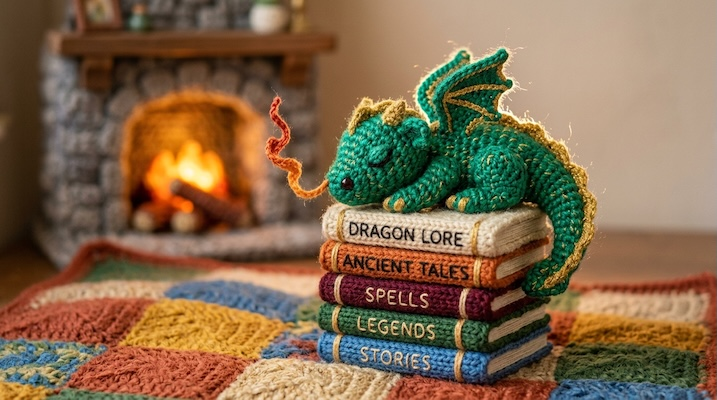

# Made of Yarn / Amigurumi

[← Back to Image Prompts](../README.md)

Cozy, tactile scenes where everything — characters, environments, and props — is crafted from knitted and crocheted yarn with individually visible stitches, fuzzy fiber edges, and warm directional lighting. The amigurumi aesthetic transforms any subject into an irresistibly soft, huggable version of itself. Every element shares the same material language: yarn, stitches, fabric, thread — nothing breaks the textile illusion.

**Best for:** Children's content · Social media posts · Product mockups · Holiday cards · Desktop wallpapers · Merchandise designs · Nursery art



---

## Prompt

Replace the bracketed details with your subject and preferred format.

```text
Macro photograph of an adorable amigurumi crocheted doll of [SUBJECT — e.g., a fox wearing a tiny knitted scarf], 1:1 square portrait format. Every individual stitch is visible across the yarn surface, with tiny fuzzy fibers catching the light at the edges. Button eyes with slight gloss. Sitting on a knitted [SURFACE — e.g., patchwork blanket]. Soft warm directional lighting emphasizing the cozy textile texture. Background is a softly blurred yarn [ENVIRONMENT — e.g., miniature yarn living room]. Everything in the frame is made of yarn, thread, or fabric.
```

## With a Reference Image

Attach your image and use this prompt to preserve its defining features while applying the style.

```text
Using the attached photo as reference, transform the entire scene into an amigurumi yarn world. Convert every person into a crocheted yarn doll with individually visible stitches and button eyes. Rebuild every object, surface, and background element from yarn, thread, or fabric. Preserve the original composition, poses, and color palette. Add warm directional lighting that emphasizes the textile texture. Fuzzy fiber edges catching the light throughout.
```

---

## 💡 Tips & Best Practices

- **"Everything in the scene is made of yarn"**: Without this explicit instruction, AI models mix real and yarn objects. Be absolute.
- **Stitch visibility is everything**: "Individually visible stitches" is the single most important phrase. Without it, surfaces look smooth and plastic rather than handcrafted.
- **Fuzzy fibers sell the material**: "Tiny fuzzy fibers catching the light along the edges" creates that authentic yarn halo effect.
- **Button eyes vs. embroidered eyes**: Button eyes create a more classic amigurumi look. Specify "safety eyes" or "embroidered French knot eyes" for variations.
- **Lighting direction matters**: Yarn texture is revealed by directional light. "Flat lighting" kills the textile effect. Always use warm side-lighting.
- **Common pitfalls**: Avoid "soft toy" or "plush" — these produce smooth stuffed animals rather than stitched yarn. Don't mix media — if one object isn't yarn, the illusion breaks.
- **Pairs well with:** [Claymation / Stop-Motion](claymation-stop-motion.md) (similar handcrafted warmth), [Embroidered / Cross-Stitch](embroidered-cross-stitch.md) (same thread/textile medium, different technique)
